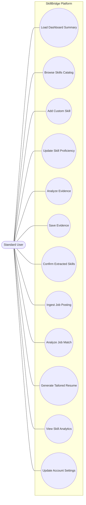
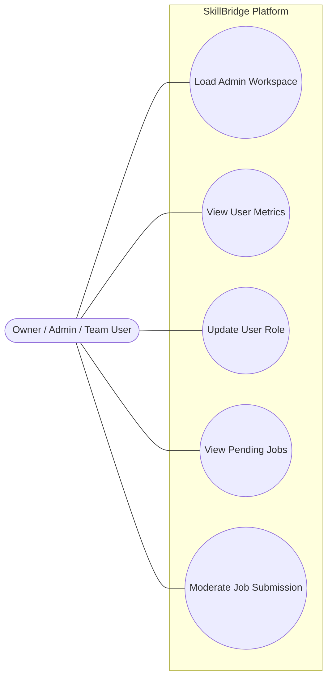
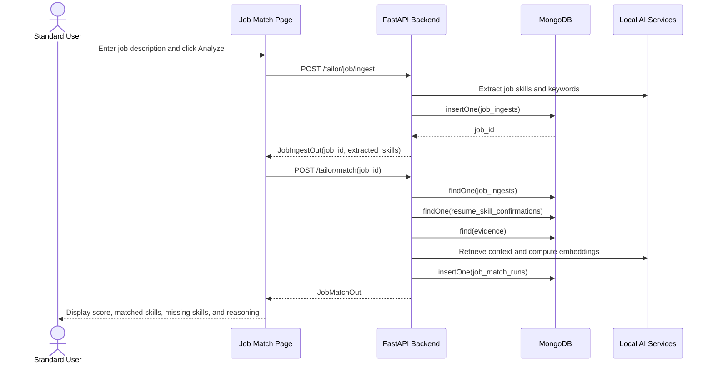
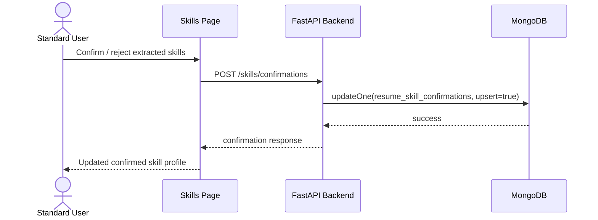
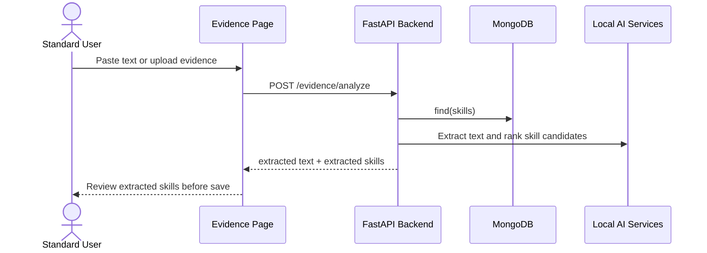
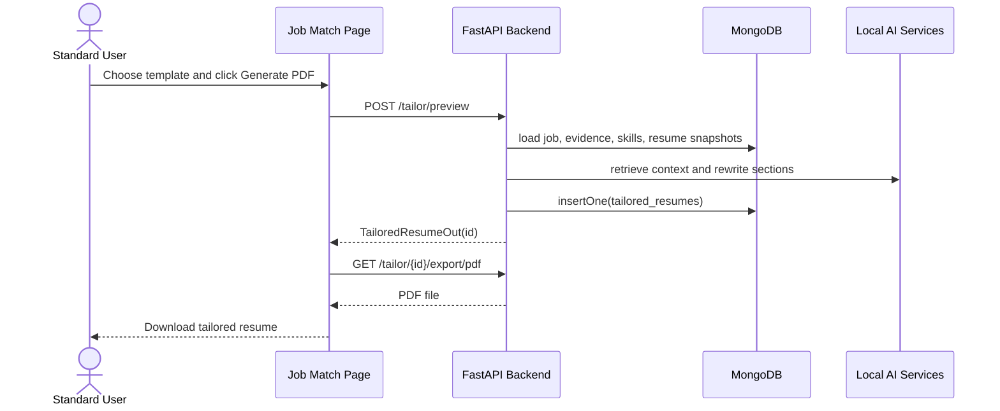
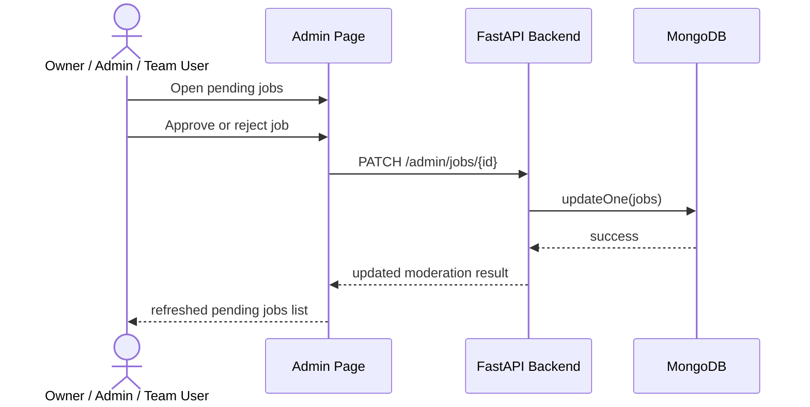
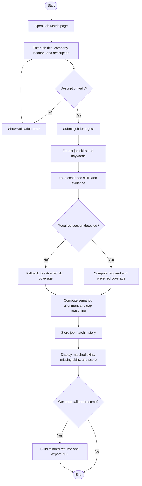
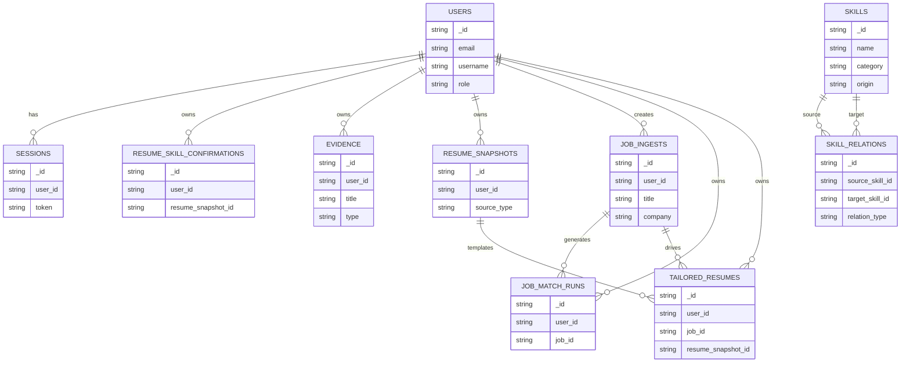

# SkillBridge Midterm Diagram Blueprints

This file contains the exact content to build the diagrams required for the midterm report and slides.

Use this in one of two ways:

1. Recreate the diagrams manually in Figma using the actor/system/message lists below.
2. Paste the Mermaid blocks into a Mermaid-compatible editor, export the images, and then place the exported images into `docs/figures/` using the filenames referenced by `docs/skillbridge_midterm_report.tex`.

Recommended export filenames:

- `docs/figures/use_case_standard_user.png`
- `docs/figures/use_case_admin_user.png`
- `docs/figures/ssd_analyze_job_match.png`
- `docs/figures/ssd_confirm_extracted_skills.png`
- `docs/figures/ssd_analyze_evidence.png`
- `docs/figures/ssd_generate_tailored_resume.png`
- `docs/figures/ssd_moderate_job_submission.png`
- `docs/figures/activity_analyze_job_match.png`
- `docs/figures/erd_skillbridge.png`

---

## 1. Use Case Diagram A: Standard User

### Figma content

Actor:
- Standard User

System boundary:
- SkillBridge Platform

Use cases inside boundary:
- Load Dashboard Summary
- Browse Skills Catalog
- Add Custom Skill
- Update Skill Proficiency
- Analyze Evidence
- Save Evidence
- Confirm Extracted Skills
- Ingest Job Posting
- Analyze Job Match
- Generate Tailored Resume
- View Skill Analytics
- Update Account Settings

Associations:
- Standard User connected to every use case above

Suggested layout:
- Actor on left
- System boundary centered
- Place dashboard / skills / evidence / jobs / resumes / analytics / account use cases in two vertical columns

### Mermaid source

---

## 2. Use Case Diagram B: Admin / Owner User

### Figma content

Actor:
- Owner / Admin / Team User

System boundary:
- SkillBridge Platform

Use cases:
- Load Admin Workspace
- View User Metrics
- Update User Role
- View Pending Jobs
- Moderate Job Submission

Associations:
- Owner / Admin / Team User connected to all five use cases

### Mermaid source

---

## 3. SSD: Analyze Job Match

### Lifelines
- Standard User
- Job Match Page
- FastAPI Backend
- MongoDB
- Local AI / Embedding Services

### Message flow
1. User enters job title/company/location/description
2. User clicks Analyze Job Match
3. Job Match Page sends job ingest request to Backend
4. Backend stores job posting in MongoDB
5. Backend extracts job skills and keywords
6. Backend returns ingested job id
7. Job Match Page sends match request with job id
8. Backend loads confirmed skills, evidence, and job record from MongoDB
9. Backend retrieves semantic context / embeddings from local AI services
10. Backend computes matched skills, missing skills, required coverage, semantic alignment, and gap reasoning
11. Backend stores job match run in MongoDB
12. Backend returns analysis
13. Job Match Page displays score, matched skills, missing skills, and reasoning

### Mermaid source

---

## 4. SSD: Confirm Extracted Skills

### Lifelines
- Standard User
- Skills Page
- FastAPI Backend
- MongoDB

### Message flow
1. User reviews extracted skills
2. User confirms or rejects skills
3. Skills Page sends confirmation request
4. Backend updates `resume_skill_confirmations`
5. Backend returns saved confirmation state
6. Skills Page refreshes confirmed skills and dashboard-driving counts

### Mermaid source

---

## 5. SSD: Analyze Evidence

### Lifelines
- Standard User
- Evidence Page
- FastAPI Backend
- MongoDB
- Local AI / Extraction Services

### Message flow
1. User uploads files or pastes text
2. Evidence Page sends analysis request
3. Backend extracts text
4. Backend loads skill catalog from MongoDB
5. Backend uses local extraction / embeddings to identify likely skills
6. Backend returns extracted text and suggested skills
7. User reviews and saves evidence

### Mermaid source

---

## 6. SSD: Generate Tailored Resume

### Lifelines
- Standard User
- Job Match Page
- FastAPI Backend
- MongoDB
- Local AI / Rewrite Services

### Message flow
1. User selects resume source and clicks Generate PDF
2. Job Match Page requests tailored resume preview
3. Backend loads job, confirmed skills, evidence, and resume template
4. Backend retrieves relevant context and rewrites targeted sections
5. Backend stores tailored resume
6. Job Match Page requests PDF export
7. Backend renders PDF and returns file

### Mermaid source

---

## 7. SSD: Moderate Job Submission

### Lifelines
- Owner / Admin / Team User
- Admin Page
- FastAPI Backend
- MongoDB

### Message flow
1. Admin opens pending jobs
2. Admin chooses approve or reject
3. Admin Page sends moderation request
4. Backend updates job moderation fields
5. Backend returns updated moderation status
6. Admin Page refreshes moderation queue

### Mermaid source

---

## 8. Activity Diagram: Analyze Job Match

### Activity nodes
- Start
- User opens Job Match page
- User enters job details
- User submits job
- System ingests job posting
- System extracts job skills and keywords
- System loads confirmed skills and evidence
- System computes match score and reasoning
- System stores analysis history
- System displays results
- User chooses reanalyze, remove skills, or generate resume
- End

Decision points:
- Is job description valid?
- Were required skills detected?
- Does user want to generate a tailored resume?

### Mermaid source

---

## 9. ERD Blueprint

Because the system uses MongoDB, the ERD should represent collections and relationships rather than relational tables. Use crow's-foot or simple connector notation in Figma.

### Core entities

#### users
- `_id`
- `email`
- `username`
- `password_hash`
- `role`
- `ai_preferences`
- `created_at`

#### sessions
- `_id`
- `user_id`
- `token`
- `created_at`
- `expires_at`

#### skills
- `_id`
- `name`
- `category`
- `aliases`
- `origin`
- `hidden`
- `created_by_user_id`

#### resume_skill_confirmations
- `_id`
- `user_id`
- `resume_snapshot_id`
- `confirmed[]`
- `rejected[]`
- `edited[]`
- `created_at`
- `updated_at`

#### evidence
- `_id`
- `user_id`
- `title`
- `type`
- `source`
- `text_excerpt`
- `skill_ids[]`
- `origin`
- `created_at`
- `updated_at`

#### resume_snapshots
- `_id`
- `user_id`
- `filename`
- `source_type`
- `raw_text`
- `created_at`

#### job_ingests
- `_id`
- `user_id`
- `title`
- `company`
- `location`
- `text`
- `extracted_skills[]`
- `keywords[]`
- `created_at`

#### job_match_runs
- `_id`
- `user_id`
- `job_id`
- `analysis`
- `created_at`
- `updated_at`

#### tailored_resumes
- `_id`
- `user_id`
- `job_id`
- `resume_snapshot_id`
- `selected_skill_ids[]`
- `sections[]`
- `plain_text`
- `created_at`

#### jobs
- `_id`
- `title`
- `company`
- `location`
- `moderation_status`
- `moderation_reason`
- `moderated_at`

#### role_skill_weights
- `_id`
- `role_id`
- `role_name`
- `weights[]`
- `computed_at`

#### skill_relations
- `_id`
- `source_skill_id`
- `target_skill_id`
- `relation_type`
- `weight`

#### learning_path_progress
- `_id`
- `user_id`
- `skill_name`
- `status`
- `updated_at`

### Relationships to draw

- `users 1 --- many sessions`
- `users 1 --- many resume_skill_confirmations`
- `users 1 --- many evidence`
- `users 1 --- many resume_snapshots`
- `users 1 --- many job_ingests`
- `users 1 --- many job_match_runs`
- `users 1 --- many tailored_resumes`
- `resume_skill_confirmations many --- many skills` through embedded `confirmed.skill_id`
- `evidence many --- many skills` through `skill_ids[]`
- `job_ingests 1 --- many job_match_runs`
- `job_ingests 1 --- many tailored_resumes`
- `resume_snapshots 1 --- many tailored_resumes`
- `skills many --- many skills` through `skill_relations`

### Mermaid source

---

## 10. Quick build order for Figma

If you are short on time, build/export in this order:

1. Use Case Diagram A
2. Use Case Diagram B
3. SSD: Analyze Job Match
4. Activity Diagram: Analyze Job Match
5. ERD
6. Remaining SSDs

That order covers the highest-value starred grading sections first.
