# SkillBridge ERD

This ERD is derived from the current backend write paths, collection indexes, and schema models in `backend/app`.

It includes:
- Core product collections
- Derived/cache collections that are persisted in MongoDB
- Operational/security collections used by auth, billing, audit, and rate limiting

It does not treat purely response-only Pydantic models as database entities.

## Mermaid ERD

```mermaid
erDiagram
    USERS {
        objectid _id PK
        string email UK
        string username
        string password_salt
        string password_hash
        string role
        boolean is_active
        string avatar_url
        string avatar_preset
        string avatar_storage_key
        string subscription_status
        string subscription_plan
        datetime subscription_started_at
        datetime subscription_renewal_at
        string billing_provider
        string stripe_customer_id
        string stripe_subscription_id
        string stripe_checkout_session_id
        int help_unread_response_count
        object onboarding
        object ai_preferences
        datetime password_changed_at
        datetime deactivated_at
        datetime created_at
        datetime updated_at
    }

    SESSIONS {
        objectid _id PK
        objectid user_id FK
        string token UK
        datetime created_at
        datetime expires_at
    }

    PASSWORD_RESET_TOKENS {
        objectid _id PK
        objectid user_id FK
        string token_hash UK
        datetime created_at
        datetime expires_at
        datetime used_at
    }

    REQUEST_RATE_LIMITS {
        string _id PK
        string scope
        string identifier
        int count
        datetime window_start
        datetime expires_at
        datetime created_at
        datetime updated_at
    }

    AUDIT_EVENTS {
        objectid _id PK
        string actor_id
        string actor_email
        string actor_role
        string action
        string target_type
        string target_id
        object details
        string ip_address
        string user_agent
        datetime created_at
    }

    BILLING_EVENTS {
        objectid _id PK
        string event_id UK
        string event_type
        boolean handled
        string message
        datetime received_at
        object payload
    }

    SKILLS {
        objectid _id PK
        string name
        string category
        array categories
        array aliases
        array tags
        int proficiency
        datetime last_used_at
        string origin
        boolean hidden
        objectid created_by_user_id FK
        array merged_ids
        datetime created_at
        datetime updated_at
    }

    PROJECTS {
        objectid _id PK
        objectid user_id FK
        string title
        string description
        datetime start_date
        datetime end_date
        array tags
        datetime created_at
        datetime updated_at
    }

    PROJECT_SKILL_LINKS {
        objectid _id PK
        objectid project_id FK
        objectid skill_id FK
        datetime created_at
    }

    EVIDENCE {
        objectid _id PK
        objectid user_id FK
        string user_email
        string type
        string title
        string source
        string text_excerpt
        array skill_ids
        objectid project_id FK
        array tags
        string origin
        boolean structured_evidence
        string org
        string summary
        array bullets
        array links
        string visibility
        int priority
        objectid legacy_portfolio_item_id
        datetime created_at
        datetime updated_at
    }

    RESUME_SNAPSHOTS {
        objectid _id PK
        objectid user_id FK
        string source_type
        string raw_text
        object metadata
        string image_ref
        datetime created_at
    }

    SKILL_EXTRACTIONS {
        objectid _id PK
        objectid resume_snapshot_id FK
        array skills
        datetime created_at
    }

    RESUME_SKILL_CONFIRMATIONS {
        objectid _id PK
        objectid user_id FK
        objectid resume_snapshot_id FK
        array confirmed
        array rejected
        array edited
        datetime created_at
        datetime updated_at
    }

    ROLES {
        objectid _id PK
        string name
        string description
        datetime created_at
        datetime updated_at
    }

    ROLE_SKILL_WEIGHTS {
        objectid _id PK
        objectid role_id FK
        string role_name
        datetime computed_at
        array weights
    }

    SKILL_RELATIONS {
        objectid _id PK
        objectid from_skill_id FK
        objectid to_skill_id FK
        string relation_type
        datetime created_at
    }

    JOB_INGESTS {
        objectid _id PK
        objectid user_id FK
        string title
        string company
        string location
        string text
        array extracted_skills
        array keywords
        datetime created_at
        datetime updated_at
    }

    JOBS {
        objectid _id PK
        string title
        string company
        string location
        string source
        string description_excerpt
        string description_full
        array required_skills
        array required_skill_ids
        array role_ids
        string moderation_status
        string moderation_reason
        objectid submitted_by_user_id FK
        objectid job_ingest_id FK
        datetime created_at
        datetime updated_at
    }

    JOB_MATCH_RUNS {
        objectid _id PK
        objectid user_id FK
        objectid job_id FK
        object analysis
        array matched_skills
        array missing_skills
        array strength_areas
        array related_skills
        objectid tailored_resume_id FK
        datetime created_at
        datetime updated_at
    }

    TAILORED_RESUMES {
        objectid _id PK
        objectid user_id FK
        objectid job_id FK
        objectid resume_snapshot_id FK
        objectid resume_evidence_id FK
        string template_source
        string template
        array selected_skill_ids
        array selected_item_ids
        array retrieved_context
        array sections
        string plain_text
        datetime created_at
        datetime updated_at
    }

    HELP_REQUESTS {
        objectid _id PK
        objectid user_id FK
        string user_email_snapshot
        string username_snapshot
        string category
        string subject
        string message
        string page
        string status
        string admin_response
        boolean user_has_unread_response
        datetime admin_responded_at
        datetime user_acknowledged_response_at
        datetime created_at
        datetime updated_at
    }

    USER_REWARDS {
        objectid _id PK
        objectid user_id FK
        object counters
        array unlocked
        datetime created_at
        datetime updated_at
    }

    LEARNING_PATH_PROGRESS {
        objectid _id PK
        objectid user_id FK
        string skill_name
        string status
        datetime updated_at
    }

    RAG_CHUNKS {
        objectid _id PK
        objectid user_id FK
        string source_type
        objectid source_id
        string title
        string text
        int chunk_index
        array embedding
        string embedding_provider
        object metadata
        datetime created_at
        datetime updated_at
    }

    USERS ||--o{ SESSIONS : owns
    USERS ||--o{ PASSWORD_RESET_TOKENS : resets
    USERS ||--o{ PROJECTS : creates
    USERS ||--o{ EVIDENCE : owns
    USERS ||--o{ RESUME_SNAPSHOTS : uploads
    USERS ||--o{ RESUME_SKILL_CONFIRMATIONS : confirms
    USERS ||--o{ JOB_INGESTS : submits
    USERS ||--o{ JOBS : submits_for_moderation
    USERS ||--o{ JOB_MATCH_RUNS : runs
    USERS ||--o{ TAILORED_RESUMES : generates
    USERS ||--o{ HELP_REQUESTS : opens
    USERS ||--|| USER_REWARDS : accumulates
    USERS ||--o{ LEARNING_PATH_PROGRESS : tracks
    USERS ||--o{ RAG_CHUNKS : indexes
    USERS ||--o{ SKILLS : authors_custom

    PROJECTS ||--o{ PROJECT_SKILL_LINKS : links
    SKILLS ||--o{ PROJECT_SKILL_LINKS : linked_in

    PROJECTS ||--o{ EVIDENCE : attached_to
    SKILLS }o--o{ EVIDENCE : supported_by

    RESUME_SNAPSHOTS ||--o{ SKILL_EXTRACTIONS : yields
    RESUME_SNAPSHOTS ||--o{ RESUME_SKILL_CONFIRMATIONS : reviewed_in
    SKILLS }o--o{ RESUME_SKILL_CONFIRMATIONS : embedded_confirmed_entries

    ROLES ||--o{ ROLE_SKILL_WEIGHTS : cached_weights
    ROLES }o--o{ JOBS : tagged_on
    SKILLS }o--o{ JOBS : required_by

    JOB_INGESTS ||--o| JOBS : promoted_to
    JOB_INGESTS ||--o{ JOB_MATCH_RUNS : analyzed_from
    JOB_INGESTS ||--o{ TAILORED_RESUMES : tailored_against

    JOB_MATCH_RUNS }o--|| TAILORED_RESUMES : may_reference

    EVIDENCE ||--o{ RAG_CHUNKS : indexed_as
    RESUME_SNAPSHOTS ||--o{ RAG_CHUNKS : indexed_as

    SKILLS ||--o{ SKILL_RELATIONS : source_skill
    SKILLS ||--o{ SKILL_RELATIONS : target_skill
```

## Scope Notes

- `portfolio_items` is a legacy collection. Current routes store structured portfolio entries in `evidence` with `structured_evidence = true`.
- `jobs` is the moderated/canonical job collection. `job_ingests` stores user-submitted job text and extracted skills before or alongside moderation workflows.
- `job_match_runs.analysis` is a large embedded analysis object; `matched_skills`, `missing_skills`, and related summary arrays are duplicated for history/list views.
- `role_skill_weights`, `rag_chunks`, and `user_rewards` are derived/cache collections, but they are persisted and therefore belong in a complete ERD.
- `request_rate_limits`, `password_reset_tokens`, `billing_events`, and `audit_events` are operational collections rather than user-facing product entities.

## Primary Sources

- `backend/app/main.py`
- `backend/app/routers/auth.py`
- `backend/app/routers/skills.py`
- `backend/app/routers/evidence.py`
- `backend/app/routers/projects.py`
- `backend/app/routers/portfolio.py`
- `backend/app/routers/jobs.py`
- `backend/app/routers/tailor.py`
- `backend/app/routers/taxonomy.py`
- `backend/app/routers/roles.py`
- `backend/app/routers/admin.py`
- `backend/app/routers/billing.py`
- `backend/app/utils/rag.py`
- `backend/app/utils/rewards.py`
- `backend/app/utils/security.py`
- `backend/app/utils/role_weights.py`
